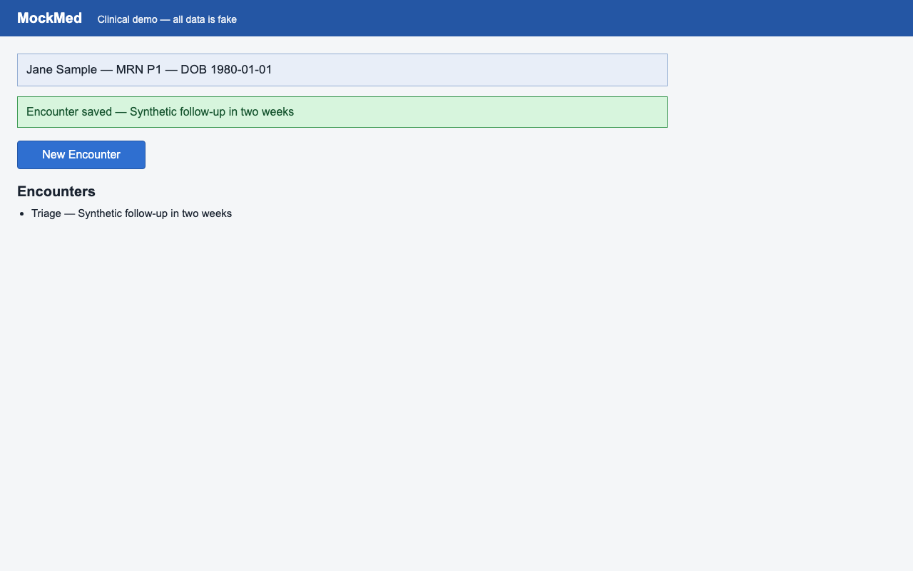

# ✅ local-quickstart — VERIFIED

- **Started:** 2026-10-09T17:23:11.005514+00:00
- **Execution profile:** `standard` (production-eligible)
- **Required contracts passed:** authorization 1/1, identity 5/5, postcondition 9/9, effect 2/2
- **Evidence classes:** `authorization`, `effect_tier_1`, `identity`, `postcondition`
- **Model calls:** 0
- **External network calls:** `observed`
- **Steps:** 6/6 ok
- **Heals:** 0
- **Screenshot egress:** none observed (zero screenshots left the box)
- **Governed authorization:** `240775611d1240bcb29d9524c9b97db5` (openadapt-flow-tutorial)
- **Admitted policy:** clinical-write; runtime inputs bound to `342463e1dfa0e45e5a5dac4c34a3daf2f1499aeeb2fa7eefeb8f0a9a027b3ea1`

## Parameters

| Param | Value |
| --- | --- |
| `note` | Synthetic follow-up in two weeks |

## Identity protection coverage

**5 of 5 click steps identity-armed.** Unarmed clicks proceed with **no identity verification** (see docs/LIMITS.md).

## Effect verification (system of record)

**1 of 6 executed step(s) carried a system-of-record effect contract** — 1 confirmed, 0 halted, 0 approved-unverified. Steps without a contract have only screen evidence for their local step outcome (run `openadapt-flow lint` for the bundle's per-consequential-step effect coverage).

## Steps

| # | Step | Intent | Rung | Confidence | Verified | ms | Healed | OK |
| --- | --- | --- | --- | --- | --- | --- | --- | --- |
| 1 | `step_000` | click 'Open' | structural | 1.00 | id ✓ | 4097 |  | ✅ |
| 2 | `step_001` | click 'New Encounter' | structural | 1.00 | id ✓ | 6713 |  | ✅ |
| 3 | `step_002` | click 'Triage' | structural | 1.00 | id ✓ | 1305 |  | ✅ |
| 4 | `step_003` | click recorded visual target | structural | 1.00 | id ✓ | 1417 |  | ✅ |
| 5 | `step_004` | type <note> | &mdash; | &mdash; | input ✓ | 1085 |  | ✅ |
| 6 | `step_005` | click 'Save Encounter' | structural | 1.00 | id ✓, effect ✓ | 8849 |  | ✅ |

## Per-step evidence

Every step below shows the frame **before** and **after** the action next to the resolution rung, the identity-gate and effect-check verdicts, and whether the step healed or halted. The generator links only retained run artifacts and never synthesizes pixels. If image redaction was enabled when a frame was persisted, that redaction is already burned into its pixels; a frame the run did not retain is marked _not retained_.

### 1. `step_000` — click 'Open'

**Rung** `structural` (conf 1.00, resolved (776, 186)) · **Gates** id ✓ · **Heal** none · **Outcome** ✅ ok

| Before | After |
| --- | --- |
|  |  |

### 2. `step_001` — click 'New Encounter'

**Rung** `structural` (conf 1.00, resolved (114, 159)) · **Gates** id ✓ · **Heal** none · **Outcome** ✅ ok

| Before | After |
| --- | --- |
|  |  |

### 3. `step_002` — click 'Triage'

**Rung** `structural` (conf 1.00, resolved (85, 214)) · **Gates** id ✓ · **Heal** none · **Outcome** ✅ ok

| Before | After |
| --- | --- |
|  |  |

### 4. `step_003` — click recorded visual target

**Rung** `structural` (conf 1.00, resolved (344, 350)) · **Gates** id ✓ · **Heal** none · **Outcome** ✅ ok

| Before | After |
| --- | --- |
|  |  |

### 5. `step_004` — type <note>

**Rung** &mdash; (keyboard / wait step, no anchor) · **Gates** input ✓ · **Heal** none · **Outcome** ✅ ok

| Before | After |
| --- | --- |
|  |  |

### 6. `step_005` — click 'Save Encounter' (final step)

**Rung** `structural` (conf 1.00, resolved (134, 457)) · **Gates** id ✓, effect ✓ · **Heal** none · **Outcome** ✅ ok

| Before | After |
| --- | --- |
|  |  |

## Rung histogram

| Rung | Count | |
| --- | --- | --- |
| `template` | 0 |  |
| `template_global` | 0 |  |
| `ocr` | 0 |  |
| `geometry` | 0 |  |
| `grounder` | 0 |  |
| `structural` | 5 | █████ |

## Totals

| Metric | Value |
| --- | --- |
| Total time | 23568 ms |
| Steps ok | 6/6 |
| Heals | 0 |
| model_calls | 0 |
| est_model_cost_usd | $0.0000 |
