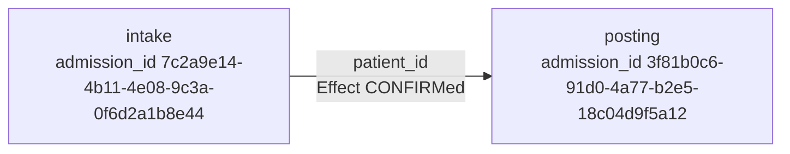

You get two independently admitted programs and a parent receipt that names both admission ids. The one fact that crosses from the first program into the second is a `patient_id` that the first program's Effect already CONFIRMed.

Those `admission_id`s are examples. A live envelope uses a UUID and binds a bundle digest. It expires in 30 days. Inspect the receipt. It has to name both.

Intake has already been admitted. Posting has already been admitted. The parent does not become a bigger recording.

## Switching, not length

[WindowsWorld](https://arxiv.org/abs/2604.27776) (arXiv:2604.27776) scored computer-use agents on 181 professional Windows tasks across 17 applications. About 78% of the suite crosses applications. The best final score in their table is 20.44%, from Gemini-3-flash-preview looking at a screenshot plus an accessibility tree.

A longer task is an easy explanation. They ruled it out. On a step-matched slice, single-app work took 10.92 expert steps and two-app work took 11.26. Intermediate score went from 65.74% to 35.14%. Final success went from 46.15% to 14.29%. Horizon barely moved. The switch did.

Computer-use agents treat the desktop as one POMDP. OpenAdapt does not. The unit a ProcessContract sequences is an admitted capability, bound to the surface it was qualified on, invoked through Execute. An agent that alt-tabs has to keep `patient_id` in its head. A ProcessContract will not copy that fact unless intake's Effect CONFIRMed it.

We haven't run OpenAdapt on WindowsWorld. Those numbers describe agents that click across the desktop. They don't describe a ProcessContract parent. I'm using them because they isolate the failure a consequential handoff has to survive: the second application starts on a fact nobody proved.

## Recordings you have not admitted yet

[Flow #430](https://github.com/OpenAdaptAI/openadapt-flow/pull/430) sequences compiled recordings into `composition.json`. You pass `--child intake=./intake-bundle --child posting=./posting-bundle --handoff intake.patient_id=posting.patient_id`. Child B starts only after child A ends `VERIFIED`. Handoffs copy parameter values that A's confirmed effect contract already bound. Window titles and URLs are not evidence. Missing evidence HALTs. `certify` and `run` execute the parent directory. `replay` refuses it.

I almost treated that as the process layer. #430 and [Flow #432](https://github.com/OpenAdaptAI/openadapt-flow/pull/432) (REST `ApiBinding` admission onto a step) opened the same night, and sitting next to an idea is how you smuggle it. #430's own summary says "No process contract." Keep that true.

A compiled recording is not an independently admitted capability. `compose` is the right sequencer when you have two recordings and you have not admitted them yet. A ProcessContract will refuse a `composition.json` of copied recordings. That refusal is the point of the first implementation. You cannot admit children by proximity.

Flow's [limits page](https://github.com/OpenAdaptAI/openadapt-flow/blob/main/docs/LIMITS.md) already says compose does not introduce a process contract, and it does not retarget a child onto a surface it was not recorded on. Live Citrix is out of scope there. Same here.

## What the parent adds

RFC-0001 names the next layer. A ProcessContract is a parent over children that each present a valid `openadapt.qualification-admission/v1` envelope. The envelope binds a workflow version and a bundle digest. It also binds a counted campaign plus the identity and effect contract digests. Lifetime is 30 days. Signature is Ed25519. `admission_id` stays distinct from `runtime_validation_id`. Sitting next to another capability does not widen any of that.

Child B starts only after A is `VERIFIED` and A's Effect CONFIRMed the handoff fact. An expired admission HALTs before Execute. So does a revoked one, and a digest that no longer matches the envelope.

The parent does not become a bigger `ProgramGraph`. It adds sequencing policy: which admitted capabilities run, in which order, which confirmed facts may copy, which halt classes a successor will absorb. Schema name `openadapt.process-contract/v0`. Compose's parent is `openadapt.composition/v1`. Keep those two names apart.

The parent directory does not copy child bundles. Compose copies children because they are recordings. Admitted capabilities already live behind Execute. The parent points at them.

I'll defend this. Most orchestration treats composition as a bigger script. If the parent can mint a fact a child did not confirm, or run a child whose admission is expired, revoked, or bound to a different bundle digest, you have a script with extra YAML. That's the bug. Competitors will call this pedantry. A process that posts after intake has to prove the `patient_id` it hands off was bound by intake's confirmed effect, under intake's own admission, on intake's recorded surface.

The child invocation is Execute. Flow #430 reserved `execute(capability, admission, inputs)` and currently binds it to governed `run`. Don't bind a process child to raw `replay`.

I haven't measured a process-level receipt yet. I'd guess the minimum a reviewer can check is, for each child, `admission_id`, `workflow_version_id`, `bundle_content_digest`, and terminal outcome; for the handoff, that the source was `VERIFIED`. Parent `VERIFIED` only if every child is `VERIFIED` and the total model-call count is 0.

A healthy parent still makes zero model calls. There is no `process_contract.py` in Flow today. RFC-0001 is the contract. The first code, when we write it, serializes the parent artifact and calls Execute.

This is not a Production claim, and it is not an SLA. The first fixture is two locally admitted capabilities and one handoff. If a test key leaks into a production trust map, the MVP failed.

## The graph you actually review

Flow's `visualize` on origin/main draws a compiled ProgramGraph for one bundle. It writes HTML, Mermaid, or JSON from that spec. It does not draw process parents yet. The review surface for a ProcessContract is the graph of admitted children, each node carrying its `admission_id`, each handoff labelled with the confirmed fact. A composition of recordings is a different artifact. Don't read a `composition.json` as if it were a process receipt.

If the work you care about crosses two systems of record, the property to demand is a parent receipt that names both admission ids.

**[Book a pilot at openadapt.ai](https://openadapt.ai/).**
