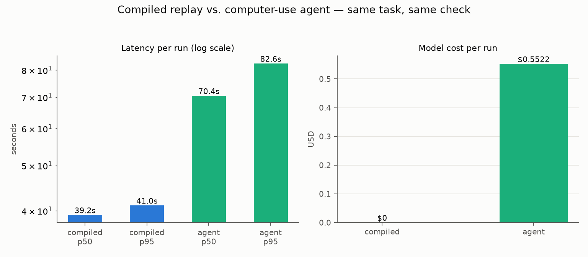
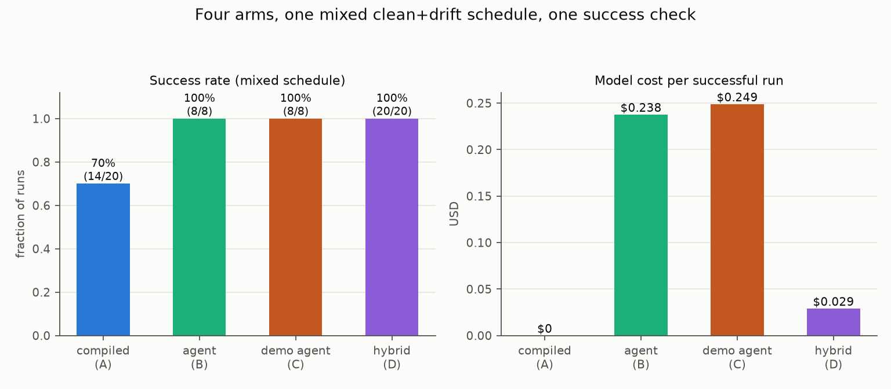

The obvious objection to [the 500th run](/posts/the-500th-run/) was "sure, it's your demo app." Fair. So on 2026-07-08 we ran the same head-to-head against the official [OpenEMR](https://www.open-emr.org/) public demo: a dense, frame-heavy, LAMP-era EMR that anyone can point software at, fake patients only.

Quick recap of what's being compared. [openadapt-flow](https://github.com/OpenAdaptAI/openadapt-flow) compiles a recorded demonstration (browser, desktop, Citrix) into a deterministic workflow. Every step carries redundant visual evidence (a template crop, an OCR label, geometry landmarks) plus postconditions derived from what your demonstration actually changed on screen. A healthy run makes zero model calls. When the UI drifts, a resolution ladder heals the step and writes the fix back as a reviewable diff. When verification fails, it halts. It doesn't improvise against a patient chart.

And I want to give the agent its due before the tables do their work. `claude-sonnet-5` went 10/10 on a real EMR from nothing but pixels and a goal. No selectors, no API. A few years ago that was science fiction. But it re-derives the task from scratch on every run, and you pay for that re-derivation every time. For the 500th referral this month, a compiler that has already seen the task doesn't need to think.

## The experiment

The task is an 18-step clinical workflow: log in as the demo admin, search for the patient, open the chart, scroll the Medical Record Dashboard to the Messages card, open Patient Messages, add a note, save.

Both arms drive the same vision-only interface: PNG screenshots in, pixel-coordinate clicks and keystrokes out, no DOM selectors at run time, a fresh browser per run. The agent arm is `claude-sonnet-5` with the `computer_20251124` computer-use tool, prompted with user intent, not steps or coordinates. Each run writes a distinct, mutually dissimilar note, and success is judged by one arm-independent OCR check on the final screenshot. Neither arm grades itself.

Scope, stated once: live shared demo instance, model pinned as above, run on 2026-07-08, agent N=10 because agent runs cost real money and real load on a public service. The engine is part of that scope: every number below was measured on **openadapt-flow 0.1.0**, the version declared at benchmark commit [`cbec44c2`](https://github.com/OpenAdaptAI/openadapt-flow/tree/cbec44c2c2f355d5cc04a72ea9267e2d6ea68ac6) (`v0.1.0-24-gcbec44c`), before `v0.2.0`, the first release tag that contains it. Full methodology and raw data: [benchmark/openemr/BENCHMARK.md](https://github.com/OpenAdaptAI/openadapt-flow/blob/main/benchmark/openemr/BENCHMARK.md).

## The numbers

| | compiled replay | computer-use agent |
|---|---|---|
| runs | 20 | 10 |
| task success | 100% (20/20) | 100% (10/10) |
| latency p50 | 39.2 s | 70.4 s |
| latency p95 | 41.0 s | 82.6 s |
| model calls / run | 0 | ~24 |
| model cost / run | $0 | $0.5522 |
| total model cost | $0 | $5.52 |

**Measured on Flow 0.1.0, 2026-07-08.** A pre-`v0.2.0` source build at commit [`cbec44c2`](https://github.com/OpenAdaptAI/openadapt-flow/tree/cbec44c2c2f355d5cc04a72ea9267e2d6ea68ac6). These figures have not been re-measured on a later release.



Both arms went perfect on task success. The difference is everything else. The compiled replay is 1.8x faster end to end (most of the remaining time is OpenEMR itself), makes zero model calls against the agent's ~24 model-mediated actions, and costs $0 against $0.55 per run at list price.

Run this workflow 500 times a month — an ordinary number for back-office work — and the agent bill is roughly $275 plus ten hours of cumulative wall clock, re-deriving the same 18 clicks 500 times. Compiled: $0 and about five and a half hours, with every action auditable against the demonstrated script. The agent's one structural advantage is that it needs no demonstration. That matters for a task nobody runs twice. It stops mattering the second time.

Because the public demo is shared and mutable, we keep a CI-reproducible anchor on MockMed, the demo clinic app bundled in the repo: 100/100 compiled vs 20/20 agent, 4.9 s vs 37.5 s median, $0 vs $0.27 per run, also on Flow 0.1.0 on 2026-07-08 ([benchmark/BENCHMARK.md](https://github.com/OpenAdaptAI/openadapt-flow/blob/main/benchmark/BENCHMARK.md)). Anyone can rerun that one deterministically.

## Drift is where compilers are supposed to die. So we benchmarked that too.

The standard argument for agents is resilience: the UI changes, the script breaks, the agent adapts. I think the right answer is a hybrid. Compiled-first, with an agent fallback that fires only on a detected halt. The compiled program runs the task for $0; when a postcondition fails, it stops before writing anything and hands the agent a serialized copy of the demonstration plus exactly where and why it halted.

On a frozen 20-slot schedule with 30% injected drift (interstitials, new required fields, modal interceptors, each chosen because it forces the compiled arm to halt rather than heal):

| | compiled only | agent only | hybrid |
|---|---|---|---|
| success | 70% (14/20) | 100% (8/8) | 100% (20/20) |
| wall p50 | 5.5 s | 45.0 s | 5.3 s |
| cost / successful run | $0 | $0.2377 | $0.0290 |
| wrong-action events | 0 | 0 | 0 |

**Measured on Flow 0.1.0, 2026-07-08.** The same pre-`v0.2.0` source build (`v0.1.0-25-g7526f30`), not re-measured since.



The hybrid matched agent-only reliability at $0.029 per successful run against $0.238, about 8x cheaper. And it gets cheaper the cleaner your environment is, because clean runs cost exactly $0. The break-even math is one line: a mid-workflow fallback ($0.097 mean here) costs less than a full agent run, so on these numbers the hybrid wins at every drift rate. The scope travels with the number: 56 runs, drift the compiled arm detects and halts on, 30% mix by design. Setup and raw data: [benchmark/hybrid/BENCHMARK.md](https://github.com/OpenAdaptAI/openadapt-flow/blob/main/benchmark/hybrid/BENCHMARK.md).

Drift the ladder can absorb never reaches the fallback at all. Full dark-theme re-skins, renamed buttons, relocated controls, and a relabeled *and* reordered encounter type were all healed deterministically at $0. The last one healed via the OCR rung, still saving the correct encounter type for the correct patient.

## The row that matters most

Zero wrong-action events. Every arm, judged by final-state identity (right patient, right encounter type, this run's own note), never by any arm's self-report.

One compiled OpenEMR run tells the story in miniature. On run 20, a postcondition flagged drift after the save (a shared demo instance grows between runs) and the replayer aborted itself, while the independent check confirmed the note had saved correctly. A false alarm, technically. I'll take that trade every time. When the world stops matching the demonstration, a compiled workflow halts with an illustrated report. An agent in the same position improvises, and improvisation against a medical record is how notes end up in the wrong chart with a green checkmark.

How we got to "never silently writes the wrong thing" — the pre-click identity gate, the transactional fault model, effect verification against the system of record instead of the pixels — is its own story: [The silent wrong write](/posts/silent-wrong-action/).

## Reproduce it

```bash
pip install openadapt-flow

# CI-reproducible anchor (local, free):
openadapt-flow benchmark --n-compiled 100 --n-agent 20 --out benchmark/

# real-EMR head-to-head (needs ANTHROPIC_API_KEY; agent arm ~$5.52 list):
python scripts/openemr_demo.py benchmark

# hybrid (compiled-first, agent-fallback-on-halt):
python -m openadapt_flow.benchmark.hybrid_benchmark --out benchmark/hybrid
```

Methodology, cost guardrails, and raw `results.json` for every table above are in the repo: [benchmark/openemr](https://github.com/OpenAdaptAI/openadapt-flow/tree/main/benchmark/openemr), [benchmark/hybrid](https://github.com/OpenAdaptAI/openadapt-flow/tree/main/benchmark/hybrid). The boundary of every claim lives in [docs/LIMITS.md](https://github.com/OpenAdaptAI/openadapt-flow/blob/main/docs/LIMITS.md), written down before you ask.

If your team runs the same GUI workflow hundreds of times a month — in a browser, on a desktop, or through a Citrix window nobody else will touch — that's the work this compiler was built for. **[Book a pilot at openadapt.ai](https://openadapt.ai/).**
