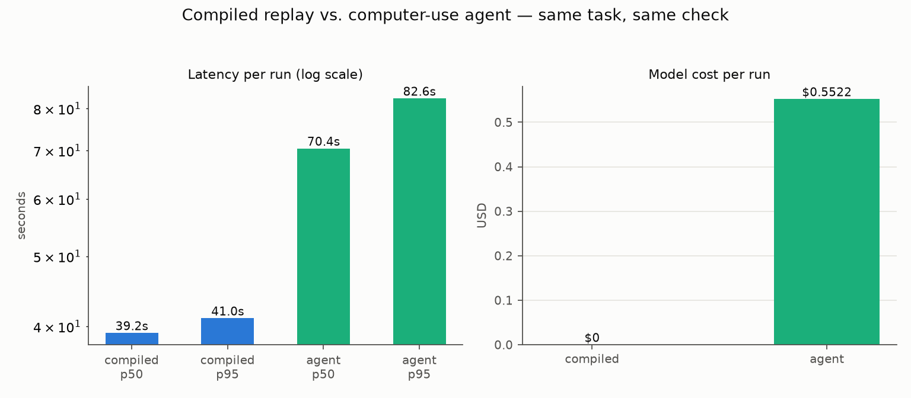
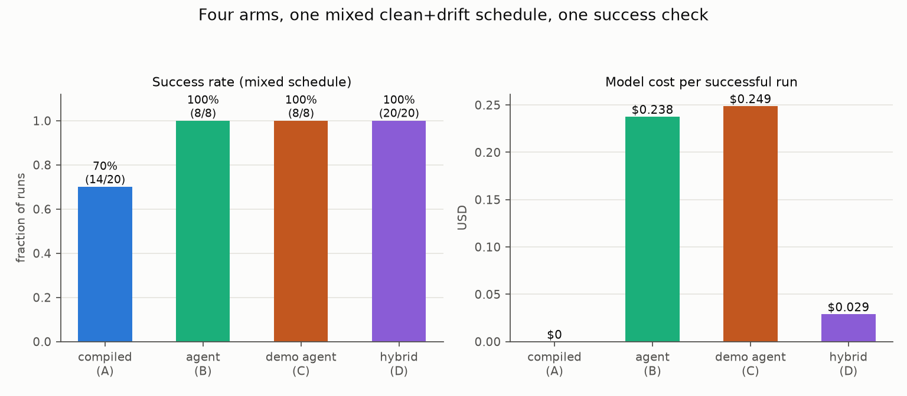

On the public OpenEMR demo, a compiled replay finished 19 of 20 runs of an 18-step charting task and made no model calls. A computer-use agent finished 10 of 10 and spent about $0.55 a run on model fees. The agent had the higher success rate. On the one compiled miss, the program clicked Save, saw that the screen didn't change as recorded, and stopped instead of reporting success. Compiled replay was also 1.8x faster at the median.

A compiled replay is a program that OpenAdapt builds from one recording of a person doing the task. A computer-use agent is an AI model that reads screenshots and picks each click. [The 500th run](/posts/the-500th-run/) compared the two on MockMed, our own demo app, so on 2026-07-08 we ran the same test on a real EMR. [OpenEMR](https://www.open-emr.org/) is an open-source EMR with dense screens, and its public demo holds only fake patients.

## What we tested

In the task, you log in as the demo admin, find a patient, open the chart, scroll to the Messages card, open Patient Messages, add a note, and save. Both sides worked only from screenshots, in a fresh browser for each run. They sent clicks and keystrokes at pixel positions and didn't use the page's HTML at run time.

The compiled side is [openadapt-flow](https://github.com/OpenAdaptAI/openadapt-flow). Each step of its program stores several ways to find its target (an image crop, the button's text, and nearby landmarks). Each step also checks that the screen changed the way it did in the recording, and when that check fails, the program stops. The agent side is `claude-sonnet-5` with the `computer_20251124` computer-use tool. Its prompt stated the goal the way a person would, with no steps or coordinates.

One check judged both sides. It read each run's final screenshot and passed the run only if that run's note appeared in a saved row of Patient Messages. Each run used a different note, and neither side graded itself. The check reads the screen; it doesn't query OpenEMR's database.

The scope is narrow. The demo is a shared public instance that resets daily and that anyone can change. The agent ran only 10 times because each run costs money and puts load on a public service. The engine was openadapt-flow 0.1.0, a source build at commit [`cbec44c2`](https://github.com/OpenAdaptAI/openadapt-flow/tree/cbec44c2c2f355d5cc04a72ea9267e2d6ea68ac6) from before the `v0.2.0` release. We haven't re-measured it on a later release. The method and raw data are in [benchmark/openemr/BENCHMARK.md](https://github.com/OpenAdaptAI/openadapt-flow/blob/main/benchmark/openemr/BENCHMARK.md).

## Results

| | Compiled replay | Computer-use agent |
|---|---|---|
| Runs | 20 | 10 |
| Runs that saved the note | 95% (19/20) | 100% (10/10) |
| Median time per run | 39.2 s | 70.4 s |
| 95th-percentile time per run | 41.0 s | 82.6 s |
| Model calls per run (median) | 0 | 25 |
| Model cost per run | $0 | $0.5522 |
| Total model cost | $0 | $5.52 |

**Measured on synthetic data**, the demo's fake patients, on 2026-07-08 with Flow 0.1.0. Costs use the July 2026 list price of $3 per million input tokens and $15 per million output tokens. An introductory $2/$10 rate applied through 2026-08-31, so the bill at the time was lower.

**Corrected 2026-07-28.** This post first said the compiled replay finished 20/20. On compiled run 20, the program clicked Save, the last of its 18 steps, and stopped because the screen didn't change the way the recording said it should. The note stayed in the open entry form. Our first check looked for the note anywhere on the final screenshot, found it in that form, and passed the run. The stricter check that replaced it requires a saved row, so run 20 is a miss and the compiled result is 19/20. Nothing else in the table moved. The machine record is `oracle_adjudication` in [results.json](https://github.com/OpenAdaptAI/openadapt-flow/blob/main/benchmark/openemr/results.json).

**Corrected 2026-10-09.** This post said the agent made about 24 model calls a run. That was the fewest in its 10 runs, and the median is 25.



*Measured on synthetic data, OpenEMR public demo, 2026-07-08. The time chart uses a log scale.*

The agent had the higher success rate, 10/10 against 19/20. At these sample sizes, one run of difference is within the noise, so neither result shows that one approach is more reliable. The gap the numbers do show is in cost and time. Compiled replay was 1.8x faster at the median and made no model calls, while the agent made a median of 25 calls and spent $0.55 a run at list price.

At 500 runs a month, those medians work out to about $276 in agent model fees and 9.8 hours of agent run time, against $0 and 5.4 hours for compiled replay. That's an estimate from the per-run figures, and we didn't measure a month of runs.

The agent's advantage is that it doesn't need a recording. The compiled program needs a person to do the task once, which took about a minute here. That favors the agent for a task you'll run once and the compiled program for a task you'll repeat.

The public demo changes daily, so we also keep a reproducible version of this test on MockMed, the demo clinic app in openadapt-flow. There, on the same date and engine, compiled replay finished 100/100 runs and the agent finished 20/20, with medians of 4.9 s and 37.5 s and model fees of $0 and $0.27 a run ([benchmark/BENCHMARK.md](https://github.com/OpenAdaptAI/openadapt-flow/blob/main/benchmark/BENCHMARK.md)).

## What happens when the screen changes

The usual case for an agent is that it adapts when an app changes and a recording stops working. So we tested a third option, compiled-first with an agent fallback, in a separate study on MockMed. The compiled program runs first. When it stops, an agent gets the recording and the step where the program stopped, and it finishes the task from there. The agent is called only when the program stops.

The schedule had 20 slots, and we injected a screen change into 30% of them: a "What's New" screen after sign-in, a new required field, or a pop-up that blocks the first Save. We picked them because each one makes the compiled program stop, and only a stop can test the fallback.

| | Compiled only | Agent only | Compiled first, agent fallback |
|---|---|---|---|
| Runs that saved the entry | 70% (14/20) | 100% (8/8) | 100% (20/20) |
| Median time | 5.5 s | 45.0 s | 5.3 s |
| Model cost per successful run | $0 | $0.2377 | $0.0290 |
| Wrong entries found | 0 | 0 | 0 |

**Measured on synthetic data**, MockMed, July 2026, with Flow 0.1.0, a pre-`v0.2.0` source build (`v0.1.0-25-g7526f30`). We haven't re-measured it since. The chart also shows a fourth arm, an agent given the recording as extra context, which matched the agent alone on success and cost slightly more.



*Measured on synthetic data, MockMed screen-change study, July 2026.*

Compiled first with an agent fallback saved the entry in 20/20 runs, the same rate as the agent alone, at $0.029 per successful run against $0.238, about 8x less. The compiled program on its own saved 14/20 and stopped on the 6 runs with a screen change.

A fallback cost $0.097 on average, less than a full agent run, so on these numbers the fallback approach costs less however often the screen changes. That holds for this study's scope: 56 runs, changes that make the compiled program stop, and a 30% mix we chose before running anything ([benchmark/hybrid/BENCHMARK.md](https://github.com/OpenAdaptAI/openadapt-flow/blob/main/benchmark/hybrid/BENCHMARK.md)).

Other changes never reach the fallback. While we designed the study, the compiled program handled a dark theme and renamed or moved buttons without a model call, finding each target again by its other clues. It also handled an encounter type that was relabeled and reordered at once, and it saved the right encounter type for the right patient.

Each run in that study was judged on its final screen, which had to show the right patient, the right encounter type, and that run's own note. That check found no wrong entries in any arm. It covers what's visible on the final screen and can't see every possible wrong action.

Both studies judged results from the screen. A check that reads the saved record back from the system is stronger, and [our post on checking the saved record](/posts/silent-wrong-action/) covers how OpenAdapt does that and what it caught in a fault test.

## Reproduce it

You need Python 3.10 to 3.12 and a clone of openadapt-flow. Agent runs need an Anthropic API key and cost real money. Today's engine is newer than Flow 0.1.0, so expect your numbers to differ.

```bash
# Python 3.10 to 3.12
git clone https://github.com/OpenAdaptAI/openadapt-flow && cd openadapt-flow
pip install -e '.[dev]'
python -m playwright install chromium

# MockMed comparison (compiled runs are free; the 20 agent runs need ANTHROPIC_API_KEY)
openadapt-flow benchmark --n-compiled 100 --n-agent 20 --out benchmark/

# OpenEMR field test (needs ANTHROPIC_API_KEY; the agent runs cost about $5.52 at list price)
python scripts/openemr_demo.py benchmark

# Screen-change study: compiled first, agent fallback when the program stops
python -m openadapt_flow.benchmark.hybrid_benchmark --out benchmark/hybrid
```

The method and raw results, with the agent cost limits, are in [benchmark/openemr](https://github.com/OpenAdaptAI/openadapt-flow/tree/main/benchmark/openemr) and [benchmark/hybrid](https://github.com/OpenAdaptAI/openadapt-flow/tree/main/benchmark/hybrid). [docs/LIMITS.md](https://github.com/OpenAdaptAI/openadapt-flow/blob/main/docs/LIMITS.md) lists what these results don't cover. Point the OpenEMR script only at the public demo, which holds fake patients.
