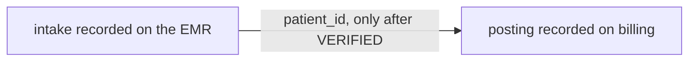

You record intake on the EMR. You record posting on billing. OpenAdapt copies `patient_id` from the first program into the second only after intake ends `VERIFIED`.

```bash
openadapt-flow compose \
  --child intake=./intake-bundle \
  --child posting=./posting-bundle \
  --handoff intake.patient_id=posting.patient_id \
  --out composed
```

That's a two-app workflow with one named fact. Child B doesn't start on a guess. If the fact is missing, the parent HALTs.

Computer-use agents do something else. They treat the whole desktop as one environment, screenshot in and click out, and they stall when the work crosses a window.

## Switching is the drop

[WindowsWorld](https://arxiv.org/abs/2604.27776) (arXiv:2604.27776) built 181 professional Windows tasks across 17 applications. 78% of them need more than one app. The best final success in their table is 20.44%, from Gemini-3-flash-preview looking at a screenshot plus an accessibility tree.

I expected length to be the story. Longer tasks fail more. The paper checked that.

They compared a step-matched subset of single-app and two-app tasks. Minimum expert steps were 10.92 and 11.26, almost the same horizon. Intermediate score fell from 65.74% to 35.14%. Final success fell from 46.15% to 14.29%.

The surprise is the switch.

OSWorld already had this in 2024, on a smaller slice: 13.74% on single-app tasks, 6.57% on the workflow subset that crossed applications ([Xie et al.](https://arxiv.org/abs/2404.07972)). UFO2 specialized an AppAgent per window and still posted 9.1% on OSWorld-W cross-app work ([Zhang et al.](https://arxiv.org/abs/2504.14603)).

I'd guess a larger model doesn't fix this by staring at the desktop harder. The agent has to keep a record identity while the foreground app changes. Clipboard residue, or an alt-tab that lands on the wrong sibling window, taxes state. Step count doesn't.

Agents formalize the desktop as a POMDP. That model fits exploratory computer use. A consequential handoff needs a smaller unit. An identifier that left a verified write in application A has to arrive as an input in application B.

We haven't run OpenAdapt on WindowsWorld. Those numbers describe agents that click across the desktop. They don't describe a composed Flow parent. I'm using them because they isolate the failure the compose contract is built to refuse. The second application starts on a fact nobody proved.

## You record twice

OpenAdapt's unit is the surface you demonstrated. Browser recording owns one tab and refuses a popup that becomes a new tab. macOS and Linux bind one exact app and window. A governed Windows run binds application identity. Worklists repeat that bundle over input records. Subflows reuse steps inside it. Neither one switches backends.

If a task crosses a browser and a native app, you record one bundle per surface. You don't get a desktop-wide agent.

I will defend that.

A compiled intake bundle is evidence-bound to the EMR you recorded. A compiled posting bundle is evidence-bound to billing. Compose copies those children into a parent directory. The parent artifact is `composition.json` plus the copies, not a bigger ProgramGraph. `certify` and `run` execute the parent. `replay` refuses it. There's no parent `--backend` that retargets a child onto a surface it was never recorded on.



Two demonstrations is real cost. You sit through intake. You sit through posting. Then you name the handoff. Default order is `--child` order. `--after NAME=PRED` declares a DAG, and a cycle refuses at authoring. What you buy is that posting cannot start on a window title.

Capture already pushed us this way. Window-scoped recording puts one window in its own pixel space, so a compiled bundle doesn't inherit the rest of the desktop as evidence. Compose does the same job one level up. Keep the surface sealed. Name the one fact that is allowed to cross.

## A handoff copies a confirmed effect

In the two-child fixture on `origin/main`, intake writes through MockMed and an independent verifier. Posting is a local FakeBackend that receives the verified `patient_id`. If intake ends `VERIFIED` but the effect fact is empty, posting never starts. If intake halted, posting never starts unless you named that halt class with `--allow-halt`.

Flow doesn't copy "whatever was on screen." A handoff copies a parameter that the predecessor's confirmed effect contract already bound. Window titles and URLs are not evidence.

A clinic that posts after intake has to prove the `patient_id` it hands off was bound by intake's write, on intake's recorded surface. Guessing from a title is how you post to the wrong chart.

This is not a Production claim, and it isn't an SLA. The compose claim in Flow is bound to required CI. Authoring rejects a source that isn't effect-bound, a cycle in the `--after` graph, a handoff that points backwards, a composition with one child, and a target parameter the destination bundle doesn't declare. Runtime tests HALT on missing evidence and on an unverified predecessor. The fixture's second child is a local mock backend, not a live Citrix session and not a field campaign. That boundary is in [openadapt-flow#430](https://github.com/OpenAdaptAI/openadapt-flow/pull/430), merged 2026-08-29, and in [`docs/LIMITS.md`](https://github.com/OpenAdaptAI/openadapt-flow/blob/main/docs/LIMITS.md) on `origin/main`.

At run time the parent is a sequencer. Child A executes through governed `run`. Only a `VERIFIED` outcome (or a halt class you named) may mint a handoff fact. Child B starts with that fact already in its inputs. Healthy children still make no generative-model API call; the parent doesn't get to invent one either. If every child finishes but the parent can't call the whole thing `VERIFIED`, the outcome is `COMPLETED_UNVERIFIED`. That encoding is already in the runtime.

Compose of recordings is also not admission of capabilities. A ProcessContract, when we build one, will sequence independently admitted workflow versions. Each child already carries a signed, expiring envelope and its own counted campaign. Sitting two compiled recordings in a parent directory doesn't admit them. I almost elided that the night the PR opened. Keep the names apart.

`visualize` still shows one compiled bundle. You get the steps and the halt points, and the resolution ladder each step will try. A composition map is the next surface. It isn't shipping today.

## When an agent is still the right tool

A novel screen, or a task you haven't demonstrated, still belongs to a computer-use agent. I already wrote that [comparison](/posts/openadapt-vs-computer-use-agents/). This post is the other case. The same two-app transaction, every week, where the second app must not run on a guessed identifier.

You record intake. You record posting. You name the handoff. Then:

```bash
openadapt-flow certify composed --policy clinical-write
openadapt-flow run composed --config deploy.yaml
```

If you installed the launcher, `openadapt flow compose` is the same command. Qualify the children and the handoff, then the end-to-end result verifier, before you point this at a real write. The [README](https://github.com/OpenAdaptAI/openadapt-flow#readme) on `origin/main` is the current contract.
