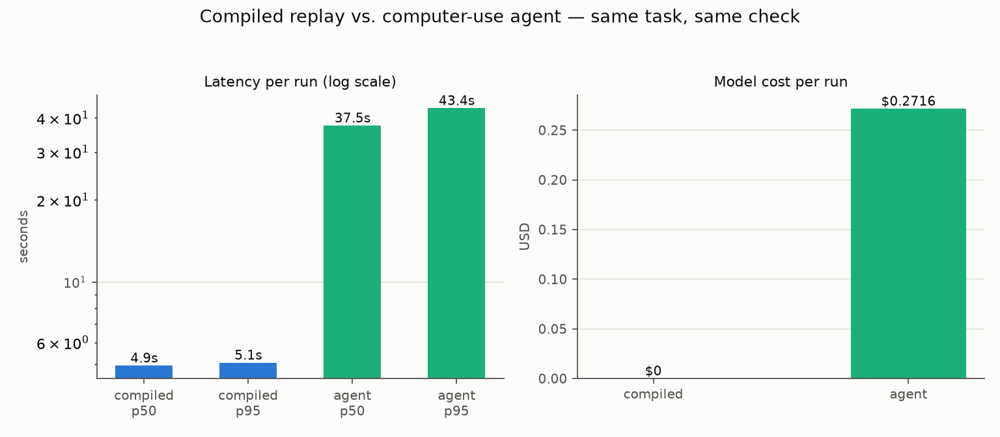

Computer-use agents are good now. Point one at a screenshot and a goal and it'll find the button, on software it has never seen, with no selectors and no API. That still feels a little like magic to me.

But watch one do the same task for the fiftieth time. It re-reasons everything, every run. Same login screen, same referral queue, same eleven clicks. Each time, a frontier model stares at the pixels and thinks the whole thing through again, and you pay for that thinking in seconds and tokens. Occasionally you also pay in a creative wrong answer.

That's the right shape for a task nobody has automated before. It's the wrong shape for the 500th referral this month.

## Record once, replay for free

[openadapt-flow](https://github.com/OpenAdaptAI/openadapt-flow) makes the other bet. You record the workflow once, and it compiles the demonstration into an editable script where every step carries redundant visual evidence (a template crop, an OCR label, geometry landmarks) plus assertions about what the screen should look like after the action. At replay time, a resolution ladder finds each target: local template match first, then global template match, then OCR, then landmark geometry, and only as a last resort a grounding model. When the UI drifts, whatever rung still works finds the target and the fix is written back to the script as a diff you can review.

Healthy scripts never leave the first rung. Milliseconds per step, zero model calls.

## The experiment

I wanted an honest number for how these two approaches compare on repetition, so on 2026-07-08 we benchmarked them head to head. One task, two ways to run it, one success check.

The task runs against MockMed, the demo clinic app that ships with openadapt-flow (fake data only): sign in as `nurse.demo`, open the first referral task, create a New Encounter of type Triage, enter a note, save.

The two arms:

- **Compiled replay.** Record the demo once through the Playwright driver, compile it, replay the bundle. Recording and compiling take about a minute of human demonstration and aren't counted in per-run latency; they're a one-time cost.
- **Computer-use agent.** `claude-sonnet-5` with the `computer_20251124` computer-use tool, a 25-action budget, and history bounded to the last 3 screenshots. The prompt states user intent (the task above), not steps or coordinates.

Both arms drive the exact same vision-only backend: PNG screenshots in, pixel-coordinate clicks and keystrokes out. Neither touches the DOM at run time, and each run gets a fresh browser page. And neither arm gets to grade itself. After every run, OCR on the final screenshot has to find both the "Encounter saved" banner and the new Triage encounter row, or the run counts as a failure.

The engine is part of the setup: this ran on **openadapt-flow 0.1.0**, the version declared at benchmark commit `cbec44c2` (`v0.1.0-24-gcbec44c`), before `v0.2.0` — the first release tag that contains it. We did 100 compiled runs and 20 agent runs. The asymmetry is honest cheapness: agent runs cost real money and real minutes, so the agent's success rate carries wider error bars.

## The numbers

| | compiled replay | computer-use agent |
|---|---|---|
| runs | 100 | 20 |
| success rate | 100% (100/100) | 100% (20/20) |
| latency p50 | 4.9 s | 37.5 s |
| latency p95 | 5.1 s | 43.4 s |
| model cost / run | $0 | $0.2716 |
| total model cost | $0 | $5.43 |

**Measured on Flow 0.1.0, 2026-07-08** — a pre-`v0.2.0` source build at commit [`cbec44c2`](https://github.com/OpenAdaptAI/openadapt-flow/tree/cbec44c2c2f355d5cc04a72ea9267e2d6ea68ac6). These figures have not been re-measured on a later release.



Both arms succeeded every single time. On this task, on this day, with this model, the agent isn't less reliable; it's slower and it costs money. That's worth saying plainly, because "agents are flaky" is the lazy version of this argument and it's not what we measured.

Cost comes from API token counts at list pricing ($3/$15 per million input/output tokens; an introductory rate through August 2026 makes today's billed cost about a third lower). To do 20 runs of a five-screen task, the agent read 1.68M input tokens, mostly screenshots.

### When the UI drifts

MockMed has a `?drift=theme` switch that re-renders the whole app in a dark palette, which invalidates every template crop the compiled script recorded. We ran one run per arm:

- Compiled, healing on: succeeded in 9.7 s with 8 heals. Lower rungs found each target and wrote fresh crops back to the bundle, so the next replay is back on the fast rung.
- Agent, as-is: succeeded in 87.4 s and $0.63, using 23 of its 25-action budget. In an earlier smoke run under the same drift, the agent exhausted its budget and failed.

One run each, on the same Flow 0.1.0 build, so treat these as existence proofs, not rates. Still, the shape is interesting: the compiled arm's bad day (9.7 s, healing as it went) was faster than the agent's median run on a UI it had already seen.

## What this means, and what it doesn't

It doesn't mean agents lose. A compiled script can't do anything nobody demonstrated. For a novel task, or an exploratory "figure out where this setting lives," the agent is the right tool, and this benchmark suggests it's a dependable one here.

It also doesn't mean these numbers generalize. MockMed is close to a best case for both arms: five screens, no scrolling, no popups, big high-contrast labels. Harder apps would slow both down and probably hurt both success rates, plausibly at different rates. I'd guess the gap widens, but that's a guess until we measure it.

What it does mean is that repetition changes the math. Run this task 500 times through the agent and you've spent about $135 at list price and around five hours of cumulative model latency, re-deriving the same clicks 500 times. Run it 500 times compiled and you've spent $0 on models and about 40 minutes of wall clock. Determinism matters too: the compiled script halts with an illustrated report when a postcondition breaks, instead of improvising around a surprise dialog. For back-office work, halting is a feature.

## Try it

The supported first run now uses the OpenAdapt launcher. It records, compiles,
certifies, and runs the bundled synthetic workflow under the Standard profile,
then verifies the saved record through a separate read-only interface:

```bash
python -m pip install --upgrade 'openadapt[browser]'

openadapt quickstart
openadapt quickstart --break-it --out openadapt-quickstart-broken
```

The first command ends `VERIFIED`. The second reruns the same certified bundle
against a backend that paints success but rejects the write. The independent
effect check catches the lie and OpenAdapt halts.

To reproduce the historical benchmark, check out the exact Flow revision named
above and install that source tree's development dependencies. The agent arm
also needs an Anthropic API key and cost about $5.43 when we ran it:

```bash
openadapt-flow benchmark --n-compiled 100 --n-agent 20 --out benchmark/
```

Full methodology, caveats, and raw results are in [BENCHMARK.md](https://github.com/OpenAdaptAI/openadapt-flow/blob/main/benchmark/BENCHMARK.md). Code is on [GitHub](https://github.com/OpenAdaptAI/openadapt-flow), the package is on [PyPI](https://pypi.org/project/openadapt-flow/). If you point it at something less polite than a demo app, I'd genuinely like to hear what breaks.
