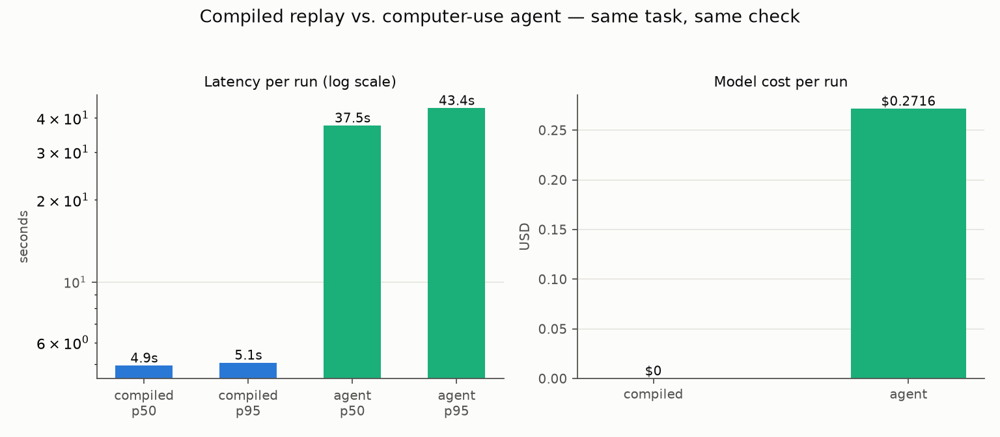

A computer-use agent is an AI model that works from screenshots and chooses each click as it goes. It doesn't need selectors, an application API, or a recording, so it can take on a task that nobody has automated yet. The cost shows up when the task repeats. The agent calls the model at each step of each run, even when the screens and the goal haven't changed since yesterday.

A compiled replay works the other way. A person does the task once while openadapt-flow records it, and the recording becomes a program that replays on later runs without calling a model.

On 2026-07-08 we measured both on one task in MockMed, the demo clinic app that ships with openadapt-flow. The compiled replay passed 100/100 runs at a 4.9 s median with $0 in model fees. The agent passed 20/20 runs at a 37.5 s median and $0.2716 a run at list price.

## What we compared

The task signs in as `nurse.demo`, opens the first referral task, creates a Triage encounter, types a note, and saves. MockMed holds fake data only.

For the compiled arm, a person recorded the task once through the openadapt-flow Playwright driver. The compiler turned the recording into a program that finds each button and field by its recorded image. Recording and compiling took about a minute and aren't counted in the run times. A clean replay ran 11 actions and used zero model tokens.

The agent arm used `claude-sonnet-5` with the `computer_20251124` computer-use tool, a budget of 25 actions per run, and the last 3 screenshots as history. Its prompt described the goal the way a person would, with no steps or coordinates.

Both arms drove the same screenshot-only interface. Screenshots went in, and clicks and keystrokes at pixel positions came out. Neither arm read the page's HTML at run time, and each run started in a fresh browser page.

One check judged both arms. After each run, text recognition (OCR) on the final screenshot had to find the "Encounter saved" banner and the new Triage row, or the run failed. Neither arm graded itself.

We ran the compiled arm 100 times and the agent 20 times, because agent runs cost money and minutes. The engine was a pre-`v0.2.0` source checkout of openadapt-flow that declared version 0.1.0, and the exact commit that ran wasn't kept.[^provenance] We haven't re-measured on a later release.

## Results

| | Compiled replay | Computer-use agent |
|---|---|---|
| Runs that passed the check | 100% (100/100) | 100% (20/20) |
| Median time per run | 4.9 s | 37.5 s |
| 95th-percentile time per run | 5.1 s | 43.4 s |
| Model cost per run | $0 | $0.2716 |
| Total model cost | $0 | $5.43 |
| Input tokens, all runs | 0 | 1,684,942 |

**Measured on synthetic data**, MockMed's fake patients, on 2026-07-08 with Flow 0.1.0. The [result artifact](https://github.com/OpenAdaptAI/openadapt-flow/blob/aee094193b232f472f991be6fa9b33c3c4b3f9be/benchmark/results.json) records the setup and the missing runtime commit. Cost is the API token count priced at the July 2026 list price of $3 per million input tokens and $15 per million output tokens. An introductory $2/$10 rate applied through 2026-08-31, so the bill at the time was about a third lower.



*Measured on synthetic data, MockMed, 2026-07-08. The time chart uses a log scale.*

Both arms passed every run, so this sample can't rank them on reliability. Twenty agent runs are too few to rule out an occasional failure, and a harder app could change either result. The sample does measure time and model cost. At the median the agent took 7.6x as long, and across its 20 runs it read 1.68 million input tokens.

## What 500 runs would cost

Repetition is where the difference adds up. At the measured medians and list price, 500 agent runs would cost about $136 in model fees (500 × $0.2716) and take about 5 hours. The same 500 runs as compiled replays would cost $0 in model fees and take about 40 minutes.

That's a projection from the 2026-07-08 medians. It leaves out the cost of recording, upkeep, and infrastructure for both approaches, and it assumes the medians hold over 500 runs, which we haven't tested.

## When the screen changes

MockMed has a `?drift=theme` switch that redraws the whole app in a dark palette, so the compiled program's recorded images stop matching. We ran each arm once with that change.

- The compiled replay passed in 9.7 s. It found 8 targets again after their recorded images stopped matching (the artifact counts these as heals) and made no model calls.
- The agent passed in 87.4 s for $0.63 and used 23 of its 25 allowed actions. In an earlier trial with the same change, it used up its budget and failed.

One run per arm can't estimate a rate. The two runs show that both approaches got through this change once. Even with the change, the compiled run's 9.7 s was faster than the agent's 37.5-second median on the unchanged app.

## Which one fits your task

Choose by how new the work is each time.

| Your task | Better fit | Why |
|---|---|---|
| New or exploratory, such as finding a setting in unfamiliar software or working a queue that changes from day to day | A computer-use agent | It starts from a plain-language goal and reasons from a fresh screenshot, so nobody has to record the path first. |
| Repeated, such as the same entry hundreds of times a month, where each run should follow a reviewed program | A recorded workflow (compiled replay) | It reuses one recording and makes no model calls on a clean run. When the screen changes, it finds the same field again or stops and asks a person. |

For either one, keep a person in control of high-impact actions until the exact workflow has the evidence and approvals it needs.

The two can share one process. An agent can explore an unfamiliar app and help a person find the path. Once the task is stable and frequent, the person records it so the compiled program can run it from then on. OpenAdapt has no connector built for a particular agent provider. An agent that speaks MCP can list and run approved workflows on the same computer through [OpenAdapt Agent](https://openadapt.ai/platform/agent).

## Limits

A compiled replay needs a demonstration first, which took about a minute here. For a task you'll run once, the agent saves you that step.

MockMed is close to a best case for both arms. It has five screens with large, high-contrast labels and no scrolling or pop-ups. Harder apps would slow both arms and could lower both success rates, maybe by different amounts. [The OpenEMR field test](/posts/openemr-benchmark/) repeats the comparison on the public demo of a real EMR.

Both arms' times include deliberate waits for the screen to settle. The results describe `claude-sonnet-5` on 2026-07-08, and newer models will differ.

## Try it

The quickstart is the supported first run. It records a small synthetic workflow and runs the compiled program, then reads the saved record back through a separate read-only interface. You need Python 3.10, 3.11, or 3.12.

```bash
python -m pip install --upgrade openadapt
openadapt quickstart
```

On Python 3.13 or newer, pip installs an old release that has no `quickstart` command. Use the installer instead, `curl -fsSL https://openadapt.ai/install.sh | sh`, then run `openadapt quickstart`.

The run ends done and checked (`VERIFIED` in the report). The report lists each action and the separate evidence for the saved record. To record your own web app next, follow the [first-workflow guide](https://docs.openadapt.ai/get-started/first-workflow/).

To rerun the benchmark, clone openadapt-flow. Today's runner repeats the same task, but it can't rebuild the July engine because that commit wasn't kept, so expect different numbers. The agent arm needs an Anthropic API key, and its runs cost $5.43 at list price when we ran them.

```bash
git clone https://github.com/OpenAdaptAI/openadapt-flow && cd openadapt-flow
pip install -e '.[dev]'
python -m playwright install chromium
openadapt-flow benchmark --n-compiled 100 --n-agent 20 --out benchmark/
```

The method and caveats are in [BENCHMARK.md](https://github.com/OpenAdaptAI/openadapt-flow/blob/aee094193b232f472f991be6fa9b33c3c4b3f9be/benchmark/BENCHMARK.md), next to the raw results. For a product-level comparison with current sources, see [OpenAdapt vs. computer-use agents](https://openadapt.ai/compare/computer-use-agents).

[^provenance]: The result rows first entered the openadapt-flow history in commit `b2eec0be`, after `45f5ba8a`. Those commits date the artifact and aren't the code that ran.
