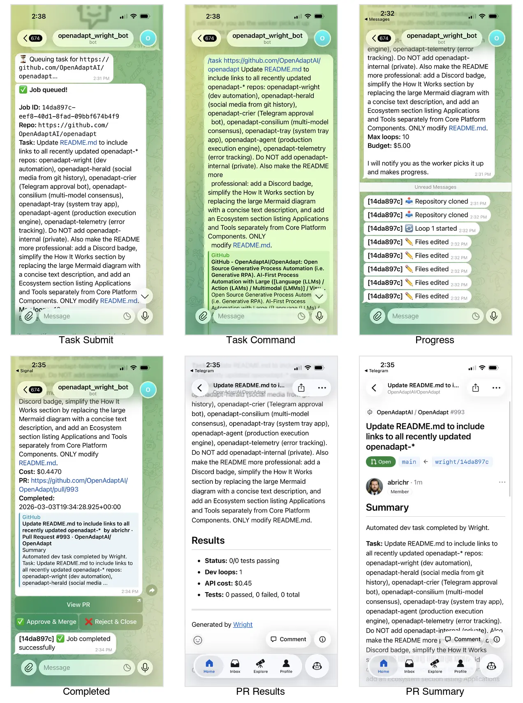

We are excited to announce that **Wright**, our dev automation worker, has successfully created its first automated pull request. This milestone marks a key step in our vision of AI-driven development workflows where routine engineering tasks are handled end-to-end by an autonomous agent.

## What is Wright?

Wright is OpenAdapt's dev automation bot. It receives task descriptions via Telegram, then uses the Claude Agent SDK to clone the target repository, detect the test runner, install dependencies, make the requested code changes, run the test suite, and open a pull request -- all without human intervention. The name comes from the concept of a "wright" (a maker or builder), reflecting its role as an autonomous craftsman in the development pipeline.

## The First Successful Task

The first task assigned to Wright was straightforward but meaningful: update the main OpenAdapt README to include links to all the ecosystem repositories (openadapt-herald, openadapt-crier, openadapt-wright, openadapt-consilium, openadapt-evals, and others). Wright completed this task in a single loop iteration, producing [PR #993](https://github.com/OpenAdaptAI/OpenAdapt/pull/993) at a cost of just $0.45 in API usage. The entire process -- from receiving the task description to opening the PR -- ran autonomously with no human edits required.

## What's Next

We are continuing to assign more tasks to Wright and refining its workflow. Near-term goals include handling more complex multi-file refactors, supporting additional test frameworks, and eventually opening Wright up to community contributors who want to submit tasks via Telegram. Each successful PR helps us validate and improve the Ralph Loop -- our iterative edit-test-fix cycle -- bringing us closer to reliable, fully autonomous development assistance.

If you are interested in following Wright's progress or contributing to OpenAdapt, check out the [openadapt-wright repository](https://github.com/OpenAdaptAI/openadapt-wright) and join our community.
